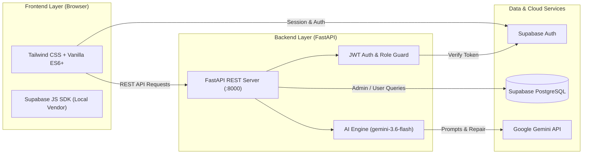

# Mindurr.ai — Project Status & Roadmap

> **Current Status:** Phase 1 (Core Platform, Auth, Profiling, AI Engine & Recruiter Matching) Complete  
> **Last Updated:** September 2026  
> **Repository:** `Mindurr.ai`

---

## 1. Executive Summary

**Mindurr.ai** is an AI-driven talent intelligence and skill profiling platform designed to bridge the gap between student abilities and industry hiring requirements. Traditional hiring relies heavily on marks, CGPA, and static resumes, which frequently fail to capture genuine problem-solving capability, practical coding proficiency, and technical potential.

Mindurr.ai provides:
- **For Students:** Diagnostic multi-step skill assessments, AI-generated technical questions, objective skill scores, deep AI insights (strengths, growth areas, career alignment), and personalized learning roadmaps.
- **For Recruiters:** Job description posting, intelligent candidate pool indexing, and semantic AI matching that ranks candidates with transparent matching reasoning.

---

## 2. Tech Stack & Architecture



### Technology Breakdown

| Component | Technology | Role & Purpose |
| :--- | :--- | :--- |
| **Frontend Framework** | Vanilla JS (ES6+), HTML5 | Lightweight, high-performance static client with zero build overhead. |
| **Styling & Design System** | Tailwind CSS (CDN) | Implementation of the **Solaris Tech Education** design system (warm amber/yellow `#eab308`, `#fcfae6`). |
| **Icons & Typography** | Google Fonts, Material Symbols | `Geist`, `Inter`, and `JetBrains Mono` fonts with Material Symbols. |
| **Backend API** | Python 3.13+, FastAPI, Uvicorn | High-throughput asynchronous REST API serving endpoints for profiling and matching. |
| **Database & Auth** | Supabase (PostgreSQL 15+) | Managed database with Row Level Security (RLS) policies and JWT authentication. |
| **AI Intelligence** | Google Gemini API (`gemini-3.6-flash`) | Contextual question generation, profile evaluation, semantic candidate matching, and resource roadmaps. |
| **JSON Handling & Reliability** | `json_repair`, `httpx` | Robust prompt extraction, exponential backoff for rate limits, and automated JSON repair. |

---

## 3. Work Completed to Date

### A. Authentication & User Journey Gateway
- [x] **Dual Role Gateway (`user_selection.html`):** Clean role-selection landing screen directing visitors to Student or Recruiter workflows with local brand logo.
- [x] **Unified Authentication (`login_register.html`):** Integrated Supabase Auth supporting registration, login, session persistence, and smart role-based redirects with local `mindurr_logo.svg`.
- [x] **Smart Post-Login Router (`config.js`):** Centralized `routeUserPostLogin()` that queries Supabase `profiles` to detect real role, routes recruiters to `recruiter_dashboard.html`, checks `skill_profiles` for students, and routes to `profile.html` (if completed) or `assessment.html` (if quiz pending).
- [x] **Role Guards & Empty States:** Added role checks on `profile.html` and `recruiter_dashboard.html` to prevent cross-role confusion, with dedicated empty-state CTAs.
- [x] **Vendorized Supabase Client (`vendor/supabase.js`):** Bundled Supabase JS SDK locally to ensure zero runtime CDN failure.

### B. Student Assessment & Skill Profiling System
- [x] **Multi-Step Assessment Wizard (`assessment.html`):**
  - **Step 1: Goal Definition:** Job search, career switch, upskilling, portfolio building, freelancing.
  - **Step 2: Industry Domain Selection:** Frontend, Backend, DevOps, Data Science, Mobile, Full-Stack.
  - **Step 3: Programming Language Selection:** Dynamic multi-select filtered by domain.
  - **Step 4: Framework & Tool Selection:** Associated technologies (e.g., React, FastAPI, Docker, PyTorch).
  - **Step 5: Assessment Engine:** 25-question technical quiz engine supporting both offline curated question banks and live AI generation.
  - **Results & Multi-Stage AI Pipeline:** Per-technology score breakdown, "Save & Analyze with AI" trigger with live stage status (`POST /api/skill-profile` -> `POST /api/skill-profile/analyze`), and automatic redirect to talent dashboard.
  - **Retake Awareness Banner:** Informs returning students that re-taking tests updates their active profile and AI insights.
- [x] **Student Profile & Intelligence Dashboard (`profile.html`):**
  - Displays overall readiness score and granular per-technology score cards.
  - Displays Gemini-generated strengths, critical skill gaps, and recommended career paths.
  - Interactive personalized learning roadmap generator targeting specific careers.

### C. Recruiter Portal & AI Candidate Matching
- [x] **Recruiter Dashboard (`recruiter_dashboard.html`):**
  - Job requisition creation with title, required skills, and full job descriptions.
  - AI Matchmaker triggering semantic analysis against all registered student skill profiles.
  - Ranked candidate list showing match scores (0–100%) and key matching qualifications.
- [x] **Candidate Profile Deep-Dive (`candidate_profile.html`):**
  - Detailed recruiter view of individual candidate performance, score breakdowns, and AI match reasoning.

### D. Python Backend & AI Engine
- [x] **FastAPI Core (`backend/main.py`):** Configured CORS, lifespan events, health checks, and modular routing.
- [x] **API Route Handlers (`backend/routes.py`):**
  - `GET /api/auth/me` — Authenticated user and role verification.
  - `GET /api/profile` & `GET /api/skill-profile` — Student profile and score retrieval.
  - `POST /api/skill-profile` — Upserting student skill scores and assessment results.
  - `POST /api/skill-profile/analyze` — Gemini AI skill analysis triggering strength/weakness generation.
  - `POST /api/questions/generate` — Dynamic MCQ generation tailored to chosen tech stack.
  - `POST /api/recruiter/job` & `GET /api/recruiter/jobs` — Job posting management.
  - `POST /api/recruiter/match` — Gemini semantic candidate matching against job criteria.
  - `POST /api/recommendations/roadmap` — Structured career roadmap and learning resource generator.
- [x] **Gemini AI Engine (`backend/ai_engine.py` & `backend/prompts.py`):**
  - Integration with `gemini-3.6-flash`.
  - Automated retry mechanisms handling 429 rate limits and 5xx server issues.
  - Fail-safe JSON extraction and parsing with `json_repair`.

### E. Database Schema & Migrations (`sql/`)
- [x] `001_profiles.sql`: User metadata table with trigger linking to `auth.users`.
- [x] `002_skill_profiles.sql`: Student skill profile table with RLS policies, scores (JSONB), and technologies.
- [x] `003_recruiter_profiles.sql`: Recruiter organization and role profile table.
- [x] `004_job_descriptions.sql`: Recruiter job postings table.
- [x] `005_candidate_matches.sql`: Recruiter-candidate matching results schema.
- [x] `006_add_ai_insights.sql`: Adds `ai_insights` JSONB column to `skill_profiles`.
- [x] `007_add_skill_goal.sql`: Adds `goal` column to `skill_profiles`.

---

## 4. Repository Structure

```
Mindurr.ai/
├── .env.example                     # Sample environment configuration
├── Design.md                        # Solaris Tech Education design system specifications
├── PROJECT_STATUS.md                # Project status, completed features & roadmap (this document)
├── README.md                        # General project introduction & setup guide
│
├── frontend/                        # Static Web Application Client
│   ├── index.html                   # High-converting marketing landing page
│   ├── user_selection.html          # Gateway: Choose Student or Recruiter role
│   ├── login_register.html          # Supabase Auth: Sign In & Sign Up
│   ├── assessment.html              # 5-step skill profiling & MCQ test wizard
│   ├── profile.html                 # Student dashboard: Scores, AI insights & roadmaps
│   ├── recruiter_dashboard.html     # Recruiter portal: Post jobs & match talent
│   ├── candidate_profile.html       # Recruiter view: Detailed candidate analysis
│   ├── config.js                    # Shared API client & auth helper functions
│   ├── mindurr_logo.svg             # Application brand logo
│   └── vendor/
│       └── supabase.js              # Bundled Supabase JS SDK client
│
├── backend/                         # FastAPI Python Service
│   ├── main.py                      # App entry point, CORS & lifespan configuration
│   ├── routes.py                    # REST API route handlers
│   ├── ai_engine.py                 # Gemini API caller, retry logic & JSON parser
│   ├── prompts.py                   # Structured system and user prompts
│   ├── database.py                  # Supabase client factory (admin & user scoped)
│   ├── auth.py                      # JWT decoding & role-based route dependencies
│   ├── config.py                    # Environment variable loader
│   └── requirements.txt             # Python backend dependencies
│
└── sql/                             # Supabase Database Migrations
    ├── 001_profiles.sql             # Profiles table & auth trigger
    ├── 002_skill_profiles.sql       # Skill profiles schema & RLS policies
    ├── 003_recruiter_profiles.sql   # Recruiter profile schema
    ├── 004_job_descriptions.sql     # Job postings schema
    ├── 005_candidate_matches.sql    # Candidate matching results schema
    ├── 006_add_ai_insights.sql      # AI insights column migration
    └── 007_add_skill_goal.sql       # Goal column migration
```

---

## 5. Upcoming Tasks & Roadmap

### Priority 1: Assessment Experience & Validation (Next Sprint)
- [ ] **Assessment Timer & Proctoring Mode:** Add optional timed sections per technology in [assessment.html](file:///D:/Coding/WebApp/Mindurr.ai/frontend/assessment.html).
- [ ] **Assessment Retake & History:** Allow students to re-take tests after a cooldown period and view progress history over time.
- [ ] **Visual Skill Radar / Spider Chart:** Embed dynamic SVG or Chart.js visual representation of student skill strengths on [profile.html](file:///D:/Coding/WebApp/Mindurr.ai/frontend/profile.html).
- [ ] **Form Validation Feedback:** Enhance inline validation and toast messages on form interactions across all pages.

### Priority 2: Recruiter Workflow & Communication
- [ ] **Direct Interview Outreach:** Add an "Invite to Interview" or "Send Message" action on [candidate_profile.html](file:///D:/Coding/WebApp/Mindurr.ai/frontend/candidate_profile.html) with automated email notification.
- [ ] **Candidate Filtering & Export:** Enable filtering candidates by minimum score, domain, and experience level, with CSV export capabilities on [recruiter_dashboard.html](file:///D:/Coding/WebApp/Mindurr.ai/frontend/recruiter_dashboard.html).
- [ ] **Job Status Management:** Ability to edit, archive, or close job postings.

### Priority 3: Practical Coding & Portfolio Evaluation
- [ ] **Interactive Code Sandbox:** Implement in-browser execution sandbox for Python and JavaScript code snippets during technical evaluations.
- [ ] **GitHub / Portfolio Analysis:** Ingest GitHub profiles to extract repository metadata, commit activity, and language distribution into the AI profiling engine.
- [ ] **Resume / CV Parsing:** PDF upload endpoint extracting work experience and projects to supplement assessment results.

### Priority 4: Scalability, Search & DevOps
- [ ] **Vector Embeddings for Candidate Search:** Implement `pgvector` in Supabase to perform hybrid semantic search on candidate profiles against job descriptions at scale.
- [ ] **Automated Testing Suite:** Add `pytest` test coverage for [backend/routes.py](file:///D:/Coding/WebApp/Mindurr.ai/backend/routes.py) and [backend/ai_engine.py](file:///D:/Coding/WebApp/Mindurr.ai/backend/ai_engine.py).
- [ ] **Containerization & Deployment:** Create `Dockerfile` and `docker-compose.yml` for backend service, and setup CI/CD deployment scripts (e.g. Render / Vercel / Cloudflare).

---

## 6. How to Run Locally

### 1. Backend Setup
```powershell
cd backend
python -m venv venv
.\venv\Scripts\activate
pip install -r requirements.txt
```
Ensure `.env` contains:
```env
SUPABASE_URL="https://your-project.supabase.co"
SUPABASE_ANON_KEY="your-anon-key"
SUPABASE_SERVICE_ROLE_KEY="your-service-role-key"
AI_API_KEY="your-gemini-api-key"
```
Start backend:
```powershell
uvicorn main:app --host 127.0.0.1 --port 8000 --reload
```

### 2. Frontend Setup
```powershell
cd frontend
python -m http.server 8080
```
Open `http://localhost:8080` in your web browser.
